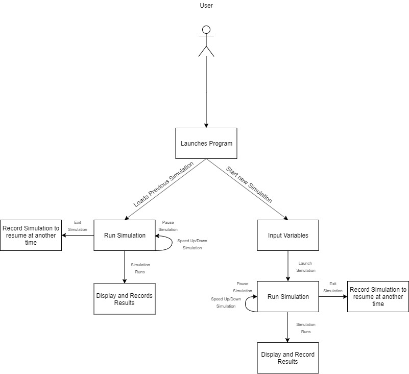
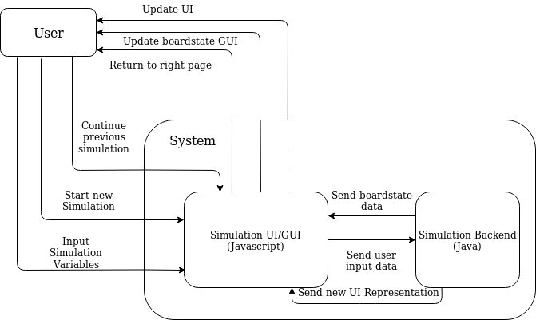
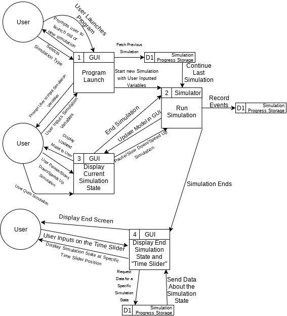
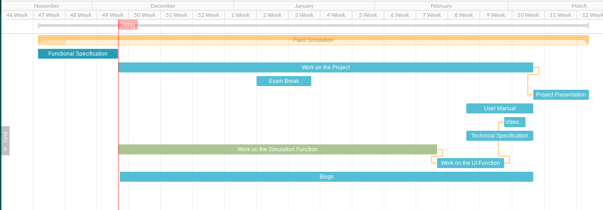

**CA326**

**Gergely Gellert**

**Nevan Oman Crowe**

**Functional Specification Document**

**0. Table of content**

A table of contents with page numbers indicated for all sections / headings should be included.

1 Introduction - Page 3 

1.1 Purpose - Page 3

1.2 Scope - Page 3

1.3 Glossary - Page 3

2 General Description - Page 5

    2.1 System Functions - Page 5
    
    2.2 User Characteristics and Objectives - Page 6
    
    2.3 Operational Scenarios - Page 7

    2.4 Constraints - Page 7

3 Functional Requirements - Page 9

	3.1 Plant Activity - Page 9

	3.2 Plant Interaction - Page 10

	3.3 Dynamic Environment Simulation - Page 11

	3.4 Genetic Alterations - Page 12

	3.5 Multi Generational Simulation - Page 13

	3.6 UI/GUI Functionality - Page 14

4 System Architecture - Page 15
 
5 High-Level Design - Page 16
 
6 Preliminary Schedule - Page 18
 
7 Appendices - Page 20

**1. Introduction**

**1.1 Purpose** 

Our system is a simulation of plant life and growth with the plants competing in a dynamic environment with the goal of reaching maturity, reproducing with another plant and carrying on their genes to the next generation. With the ultimate goal of simulating plant evolution and changes in growth patterns to increase future survival chances. 

**1.2 Scope**

The simulation would be developed in the aim of filling the space of simulating plants competing over the limited resources available to them and their changes over time adapting to their environment. The users would be able to interact with this environment specifying the abundance of resources, the amount of starting plants and the size of the environment.

The basis of the simulation and its environment would be a grid simulation of generated soil and air above with randomly allocated nutrients (in clusters) and water spread around. The first generation of seedlings would be randomly placed near the surface and be given a base amount of resources to allow for early growth, along with  randomly allocated variables for it genes. The plants growth is based on a genetic algorithm that has the plant learn how to grow more efficiently towards the resource most in demand. The algorithm learns how to grow and change each time the plant reproduces taking the genes from the two plants and mixing them as happens in real life. The algorithm is also affected by the mutation where at reproduction the plants genes can randomly mutate and affect the new generation of plants.

The simulation will be visualised through a live updating 3d model. Each time a plant grows, reproduces, die or drains a resource the model will be updated to reflect what change took place. Once the simulation has ended the user will be provided with a slider. The slider will allow the user to rewind to specific points in the simulation and provide a freeze frame of the selected state.

**1.3 Definitions / Glossary**

**Java:**
Java is a high level object-orientated programming language that we will be using to develop the back-end of the project.

**Javascript:**
Javascript is a high level object-orientated programming language that is widely used on webpages to make them interactive and more accessible. We will be developing the front-end of our project using Javascript.

**Algorithms:**
A sequence of instructions given to a computer to perform certain specified tasks.

**Genetic Algorithms:**
Algorithms that change and sometimes mutate their various attributes assigned to them whenever the plants “reproduce” through a Darwinian Style evolution.

**Jar File:**
A java program compiled and compressed into an executable file.

**Time Tick:**
A unit of time used by the simulation to simulate real time.
	
**User Interface:**
Also known as UI, it is the visual component of the program that the user sees and interacts with.

**Graphical User Interface:**
Also known as GUI, it is the visual part of the program to show the user the board state and the components interacting with each other through graphical icons 

**Dynamic:**
Changing environment in real-time due to external factors

**Genes:**
Attributes and variable associated to our simulated plants such as growth speed, resource consumption, window to reproduce in, aggressiveness.

**2. General Description**

**2.1 System Functions**

	2.1.1 User Accessing the System
The user will access the system by running the system on a computer that has an up to date Java installed. The next step would be for the user to download the .Jar file containing the programme. The user can then execute the file and have the programme run. The program will open and load up in browser page, bringing the user to the next step.

	2.1.2 Starting a simulation.
Upon starting the user will be met with the home screen UI built with the framework of 3.js opened up on a browser tab. They will then be prompted with the option to start a new simulation, continue a paused simulation or to exit the system. Upon selecting continue the most recent paused simulation will continue at the same location it was paused upon. Should the user select to start a new simulation they will be prompted with several different choices to modify the specifics of the simulation or choose to completely randomise the simulation specifications.

	2.1.3 Inside the simulation
Upon the user finishing the specifications or selecting the random simulation the board and the starting plants position will come up on the screen in the  browser tab and the plants will begin their growth. The amount of plants on the original board state is given by the user with each starting their growth based on their genes, needs and current position on the board. They will grow and fight over resources with each plant growing at different speeds and rates. They would also seek different resources all based on their genes and needs at that time.

When plants reach maturity they will wait and search for another plant to reproduce and will occur should each be in reproductive range of each other, which is based upon a value in their genes. They will then reproduce with each other, with both plants making new sets of seeds placed on the board near its now dead parent.

Upon reproduction is where the work of the genetic algorithm starts should two plants mate their genes will be mixed. The percentage mix of genes and their base % change would be based off of the parent plants static values, their fitness function and the aggressiveness of the two plants. As each plant will be making their own seeds on the board state they would have a differing mix of genes with the main parent plant having a higher base % of their genes being passed on when genes are mixed. The fitness of the two plants plants would also have an effect on the gene distribution giving the fitter plant a higher distribution value. The aggressiveness of the two plants (which is a static value in its genes) has an effect on how much of its genes will be passed
onto the next generation, with more aggressive plants having more dominant genes. The likelihood of what genes carries on from the parent plants to the next generation will be mostly random but is influenced by various factors of the parents plants, for example their aggressiveness factor or how fit a plant is.

Another part of the genetic algorithm that takes place when plants mate is the  small chance of mutation of genes. During mating there is a small change that any one of the plants variables will be altered in a positive or negative fashion. This is the mutation chance of the plant and would be determined at the beginning and can be affected by future mating.

The user will have multiple options open to them on the side of the screen during the running of the simulation. They have the ability to affect the simulation and the visual state of the board. These would be to pause and continue the simulation, speed up or slow down the rate of simulation ticks, end the simulation at the current tick or save and or exit the programme.

	2.1.4 Post Simulation
The simulation ends when it has reached one of 3 criteria. The simulation has reached the specific run time that the user specified at the start of the simulation. The user forcibly stops the simulation by quitting out of the program or there’s no longer any plants alive in the simulation.
The users will be taken to the end screen with a timeline showing the overall timeline of the simulation which can be manipulated by the user.
They can manipulated by sliding a slide bar to the left and right. They will be given the option to return to the home screen.

**2.2 User Characteristics and Objectives**

We expect users to be knowledgeable about an operating system of their choice and how to execute a basic .jar file. 

The user will be expected to be prompted by a newly opened window in their browser that they have set as default. The user can then select to either start a new simulation or load up and continue
on from an old one. If the user chooses to start a new simulation they can set such variables as follows:
    - The abundance of resources the plants need to survive
    - The size of the simulation space
    - The number of plants that the simulation starts off with
    - How long the simulation will run for.
    
During the simulation the simulation state will be shown using a 3d model displayed from their browser with each time tick, it updates the model to reflect any changes made to the board. The UI will also have buttons which the user can use to pause the simulation, save the simulation’s state so it can be reloaded and ran at a later date, either increase or decrease the real life time between each “time tick” in the simulation and a button to quit the program as a whole.

**2.3 Operational Scenarios**

The user will launch the program from either the desktop or command line using a .jar file which will open up a new page in their browser that they have set as default. They will then be prompted to either load up an old simulation and continue it or to start a new simulation. If the user selects to load an old simulation, it will load the last simulation that was run in the program and continue where it was left off. Otherwise when the user selects to run a new simulation, they’ll be prompted with a new page that will let them set certain variables such as simulation space size, the number of plants the simulation starts off with, how much of each resource will appear in the simulation space and how many “time ticks” the simulation will run for. If the user doesn’t want to decide these variables, they can randomise them with a button we will provide for them. Once they’re done they will click another button to start the simulation

The user will then be brought to a new screen where they can watch the plants grow, compete, reproduce and die within a randomly generated environment that’s based off the constraints the user inputted in the previous screen. This simulation space will be visualised to the user using a 3d model that updates itself with each change in the simulation. 
The only interaction the users have at this point is 4 buttons. The buttons can pause the simulation, speed up and slow down the simulation’s “time ticks” and quit out of the simulation. The simulation will end prematurely if there’s no more plants alive to continue.

When the simulation ends the user will be presented with a “slider”, this slider will allow the user to rewind through the simulation and wherever the user lets go of the slider, it will display what the simulation state was at that point in time. The other interaction the user gets at the end of the simulation is an exit button that quits out of the program.
 

**2.4 Constraints**

**Time Constraints**

We will have a very short amount of time during the second semester to work on this project. This could prove to be a limit to how well and how many of our project features we can implement.

**Memory Constraints**

Due to the amount of calculations the simulation might have to do each “time tick” memory can become an issue. In an example of a simulation that has 20 plants currently growing at once, it has to calculate each decision that each plants make with each “time tick” which can use up a lot of memory.

**Visualisation Constraints**

Due to the limitations of us as UI designers and 3.js’s library limitations we may not produce what we would deem satisfactory UI. We will implement accessibility guidelines and look up online examples to try alleviate this constraint as much as possible.

**3. Functional Requirements**

**3.1 Plant Activity**

Description

Plant activity is the basics of the plant growing, moving, affecting resources, resources management and reaching maturity all on a static board state. We’d also have to work upon the plant acting on its variables such as needing one of the various resources along with growing based on those needs. We need to also keep track of when and if it has the ability to grow. The simulations base is a collection of these parts working together to give us the data we need for the rest of the simulation.

Criticality

This was put first in our functional requirements as it is the very basis of the simulation and is what each other part of the simulation is built on top of. It’s needed for parts such as other plants interacting with each other and future reproduction.
	
Technical issues

The issues with this part would be balancing out the plants moving around the board state all at the same time and to make sure that each of the movements and interactions with the board happen at the same time. We’d also have to make sure that we can make all of this data computable and fast enough to support large amounts of plants.
	
Dependencies with other requirements

The plants activity is dependant on most of the other functions of the simulation. Each one changes how the plants moves and gros, such as the plants interacting with each other, the board state changing and later on the plants will change dramatically as we introduce changes of the genetic code and multiple generations of change.

**3.2 Plant Interaction**

Description

Plant Interactions is how the plants interact with each other. There's numerous ways of plants interacting with each other. First of which is when a plant wants to reproduce. When a plant reaches maturity after numerous factors, it wants to reproduce. To do this is needs to interact with another plant that also has reached maturity and are within a certain distance with each other. 

Another way the plants interact with each other is contesting with each other over resources. Depending on how much growth a plant has around a resource tile on the board, it gathers a certain amount of that specific resource per “time tick”, the interaction with other plants here is that it can compete with other plants for a resource by growing more around a tile than the other plants. This “aggressiveness” factor, how aggressive a plant should be is one of its attributes where it has a percentage chance to take the aggressive choice or not. This attribute will change over time between generations.

Another way plants will factor in this aggressive in is when the plant is considering where to grow to. If the plant sees that there’s another plant is growing nearby, there’s a chance, decided by its aggressiveness attribute it’ll grow to block off the other plant’s potential to grow towards any other resource.

Criticality

How the plants interact with each other is one of our top priorities as without it, we would just have a static simulation of a plant growing on it’s own. There wouldn’t be much depth to the project as we would only be able simulate 1 generation of plants that ignore each other’s existence. This wouldn’t reflect how plants grow and interact with each other in a real life scenario

Technical issues

The main technical issue here is to make sure that there’s enough interaction but there’s not too much. Too much aggressiveness from the plant could lead to the plants focusing more disadvantaging the other plants than growing towards what they need to reach maturity but too little aggressiveness could lead to a very passive simulation, both scenarios don’t reflect real life at all.

Dependencies with other requirements

This requirement will depend be depended on the previous requirement. Plants will decide how to interact with other plants depending on how other plants are growing, what resource that plant needs at this current time and what that plant needs to do at that current time. This requirement will also depend on the dynamic environment simulation as the way the plants decide to interact with each other, especially when deciding to compete over resources, will depend on what resources available.

**3.3 Dynamic Environment Simulation**

Description

Having a dynamic board state involves having the board  to evolve and change based on the plants actions for example the plants consuming all of a resource in an area and having the resources return after a time or plants dying and part of the plant turn into a resource tile based on what resources the plant had left. These help to change up the board as the real world would change over time.

Criticality

Having the board state be dynamic and changing is very important for the simulation as it provides a changing environment for the plants and stops repetition of the plants growing the same ways over and over again. We put this up high on the list as its an important part of having the plants learn and change how they grow.

Technical issues

This function has very few issues surrounding it as long as the above parts work in tandem with each other changing the board state shouldn't have that many issues involved.

Dependencies with other requirements

This function is heavily dependant on the plants activity and the plants interacting with each other as the board state is being changed based upon the actions of the plants for example the plants consuming all the resources in a region or dying.

**3.4 Genetic Alterations**

Description

For the plants to change and grow after reproduction modifications of their genetic code needs to take place. This is the job of the genetic algorithm, it will have two of the plants that have reached maturity reproduce together and  have a crossover of their genes occur. Modification would also take place for the randomly with the mutation of genes upon reproduction. Its needed for the plants to adapt and change to the environment they live in and the other plants around them.

Criticality

This is an important part of the simulation as a whole but is very heavily dependant on the other parts working before it can be achieved. We need to have implemented as a part of simulation to lay the ground for a multi generational environment. This is how the plants will change and adapt overtime as there will be crossover between the parent’s plants attribute everytime a new generation is produced

Technical issues

The possible issues with this requirement is to make sure that the alterations of the plants genes are within reason and allow the plant the chance of growth and survival in the next generation. Another issue is to regulate the consistency of the plants mutations and make sure it happens enough to be realistic but not too overbearing on the alterations of the genes as a whole. Along with this we want to make sure when we implement this, we see that there’s enough change that we see a noticeable improvement in the plant’s growth patterns overtime

Dependencies with other requirements

The alterations of the plants genes are heavily dependant on the other requirements above such as the basic plant activity and having the plants interacting with each other. There needs to be a base of plant genes and plant actions to work off our crossover on. It would also be heavily dependant having multi generational simulations to facilitate the reproduction and alteration of the genes.
	
**3.5 Multi Generational Simulation**

Description

This refers to the simulation running through to completion, ending when either all the plants die off or it has reached the user inputted time limit. During the simulation the plants will grow and interact with each other depending on their various attributes and when 2 plants reach maturity and reproduce, they will give birth to a new generation of plants that using genetic algorithms will have modified attributes, based off of their parent plants that will start growing in the soil.

Criticality

This is critical because this is the basis of our project, we plan to have a simulation that shows how over multiple generation plants adapt and overcome a dynamic environment. Although it’s not as critical as the other requirements as this requirement is built off the foundation that the ones before it provides.

Technical issues

Memory availability would be the largest issue here. With each generation of new plants produced, that’s more calculations the simulation has to work through leading to the potential of running out of memory. 
Along with this we’re planning to record every board state each “time tick” so we can implement a time slider feature once the simulation is over so the user can go back and view board states in particular moments in time. If the simulation is going on for a particularly long time, the amount of information we would have to record could become a memory issues again.
Time taken for calculations is the last issue that could arise. Similar to the memory availability, the more plants we have inside our simulation space, the more calculations the simulations will have to do leading to the simulation to slow down. We hope to minimize this by writing as efficient algorithms as we can.

Dependencies with other requirements

Due to the complexity of running a multi-generational simulation, this requirement depends on the Plant Activity, Plant Interaction, Dynamic Environment Simulation and the Genetic Alterations requirements. Without the foundation those requirements provides, we can’t run it at all.

**3.6 UI/GUI Functionality**

Description

This is the requirement of having a UI  built in a browser tab using javascript to facilitate the user to access the simulation as a whole and to  edit and modify the simulation with different situations along with later giving access to different views of the board state. The other functional part is to supply the user with an easy to understand GUI and to visualize the boardstate so the user can see the plants interacting with each other.

Criticality

This function is at the bottom of the list as we need the simulation to work as a whole before providing the user a visual access to the programme beyond access via a terminal. Its an important part of the project but is low on the list as it requires many parts needed to be done first.

Technical issues

The issues that could arise with this function are providing the user with an understandable and easy access to the system while making the UI and GUI suitable visually while having it facilitate the projects needs.

Dependencies with other requirements

The UI and GUI are heavily dependant on the Plant Activity, Plant Interaction and the Dynamic Environment Simulation requirements as that is what the GUI will build off of. While the UI is less dependent on these because it won’t be live updating unlike the GUI.

**4. System Architecture**

The system is composed of a Java based client that the user launches. The client will need a few user inputs at the start to start up the simulation. During the simulation the user can interact with the simulation but overall won’t really affect it.

**5. High-Level Design**

**5.1 Context Diagram**

**5.2 Data Flow Diagram**

**6. Preliminary Schedule**

**6.1 Work on the Simulation Function** 

Start and End Date - 07/12/19-14/02/20

Major Objectives -To get the simulation to run within our defined constraints

Software Requirements

Java, Java Simulation Library DESMO-J

**6.2 Work on the UI Function**

Start and End Date - 14/02/20-06/03/20
Major Objectives -To give the simulation a refined live updating UI

Software Requirements

Javascript,Javascript Library 3.js

**6.3 User Manual** 

Start and End Date - 21/02/20-06/03/20

Major Objectives

To provide a guide for the user so they can use our program

**6.4 Video Walk Through**

Start and End Date - 02/02/20-06/03/20

Major Objectives -To show a demonstration of how use our program

Software Requirements

OBS Screen capture software

**6.5 Technical Specification**

Start and End Date - 21/02/20-06/03/20

Major Objectives

To provide a detailed explanation of the technical side of our project

**6.6 Blogs**

Start and End Date - 07/12/19-06/03/20

Major Objectives

To provide a sort of timeline for how the project development

**6.7 Presentation**

Start and End Date - 06/03/20-18/03/20

Below is a Gnatt Chart for the above preliminary schedule. We constructed it using the website gnattpro.com.

**7. Appendices**

Simulation Library Desmo-j Website

http://desmoj.sourceforge.net/home.html

Javascript UI Framework 3.js Website

https://threejs.org/

Gantt Diagram Creation Website

https://ganttpro.com/