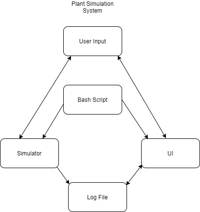
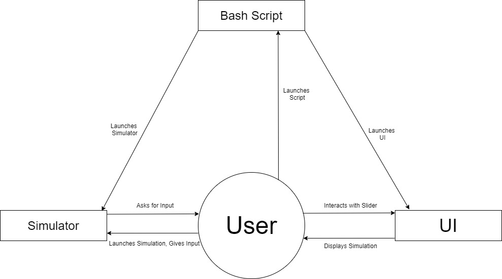
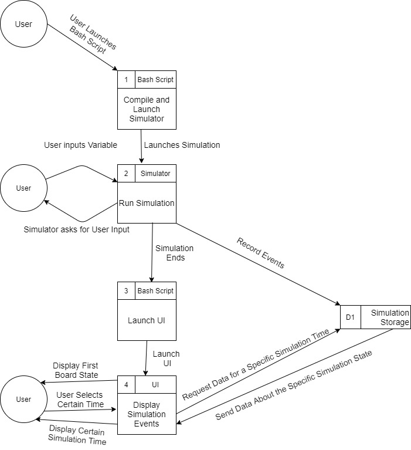
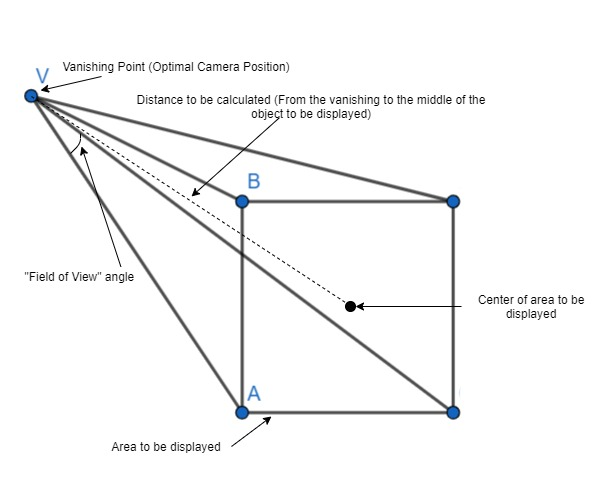

**Plant Simulation Technical Manual**

**By Nevan Oman-Crowe and Gergely Gellert**

**0. Table of content**

1 Introduction 

    1.1 Overview - Page  2 
    1.2 Glossary - Page 3 
2 System Architecture 

    2.1 Dependencies - Page 5 
    2.2 Language and Library choices -Page 5 
    2.3 The System - Page 5 
3 High-Level Design 

    3.1 Initial Design - Page 7 
    3.2 Current Design - Page 7   
    3.3 Context Diagram - Page 7 
    3.4 Data Flow Diagram - Page 8 
4 Problems and Resolution 

    4.1 Class Paths -Page 10 0
    4.2 Infinite Searching Loop -Page 10 
    4.3 Get Firefox to read log File -Page 10 
    4.4 Camera Height scaling in respect to object size -Page 10 
5 Installation Guide 

    5.1 Dependencies -Page 12 
    5.2 Setting up your Firefox to be able to work with our UI - Page 12 
    5.3 Installation of the System - Page 13 

**1.Introduction**

Plant Simulation is a simulation of plant life on a dynamic board state allowing plants to grow, die and reproduce. The primary objective of the plant is to simulate multiple plant generations and the ultimately evolution over generations of plants with the end goal of increasing the plants ability to grow and pass on its genes.

**1.1 Overview**

Plant simulation was built as a way to fill in a hole in natural life simulations which usually focus on animals. We have the plants focusing on competing over resources available to them on a changing and dynamic board state. The plants continue to grow until reaching maturity and growing up to enable reproduction with other plants and to pass on preferential genes to its children. This enables the plant to change over time to adapt to its environment.

The basis of the simulation and its environment would be a simulated board/grid of generated soil with air above to allow growth for maturity. This board contains  randomly allocated resources including Water, Iron and Nitrogen spread across the board.

The original generation of seedlings  (the amount of which is specified by the user upon start) would be randomly placed near the surface and be given a base amount of resources to allow for early growth, along with randomly allocated variables for it genes. The plants genes growth and change is based on a genetic algorithm that over time takes the genes from more successful plants and passes them onto the next generation. The algorithm is also affected by the mutation where at reproduction the plants genes can randomly mutate and affect the new generation of plants.

The User Interface for the program enables the user to visualise the simulation through a slider of boardstates enabling the user to move through the simulation over time back and forth to see the plants growth and subsequent generations of plants and their growth.

**1.2 Glossary**
	
**Java**

Java is a high level object-orientated programming language that we will be using to develop the back-end of the project.

**Javascript**

Javascript is a high level object-orientated programming language that is widely used on webpages to make them interactive and more accessible. We will be developing the front-end of our project using Javascript.

**Terminal**

A terminal or shell is a command-line interpreter that provides a command line user interface for Unix operating systems. 

**Bash/Shell Script**

A shell script is a computer program designed to be run by the Unix terminal, which enables all of the simulation to be run from a single line.

**Algorithms**

A sequence of instructions given to a computer to perform certain specified tasks.

**Genetic Algorithms**

Algorithms that change and sometimes mutate their various attributes assigned to them whenever the plants “reproduce” through a Darwinian Style evolution.

**Jar File**

A java program compiled and compressed into an executable file.

**Time Tick**

A unit of time used by the simulation to simulate real time.
	
**User Interface**

Also known as UI, it is the visual component of the program that the user sees and interacts with.

**Graphical User Interface**

Also known as GUI, it is the visual part of the program to show the user the board state and the components interacting with each other through graphical icons 

**Dynamic**

Changing environment in real-time due to external factors

**Genes**

Attributes and variables associated with our simulated plants such as growth speed, resource consumption, window to reproduce in, aggressiveness.

**2. System Architecture**

**2.1 Dependencies**

Firefox - Version 73.0.1

DESMO-J - Version 2.5.1e

three.js - Version r114

**2.2 Language and Library Choices**

We decided to use Java to code the simulator in as it is fast and efficient. When it comes to simulations and artificial intelligence, there’s a lot of computing involved so we wanted to keep the processing time to a minimum. We were also somewhat familiar with the language as we spent a semester learning it and we wanted to expand our knowledge on it further.

DESMO-J was chosen as our simulation framework due to it supporting discrete-event simulation. Discrete-event simulation is when a simulation is run as a sequence of events in time. We were looking for this type of simulation as a plant life cycle can be broken down into a sequence of events.

JavaScript was chosen as the language to primarily code our UI in. We choose this instead of Java because due to the various up to date graphical libraries available in JavaScript enable us to make a nice looking 3d models, unlike in Java where we found the end product of the Java rendering libraries lacking. Javascript also interacts with html files a lot easier than most languages so it would be a lot easier to scrape the vital information needed to display the models from the log file. Before this project we have never used JavaScript before.

Three.js was chosen to be our UI framework. This was chosen because it is widely used so there are widely available education resources to learn from as we’ve never used JavaScript before. We also picked it because we knew that it was capable of rendering 3d models from the countless demos available online.

**2.3 The System**

The system is composed of the simulator that is coded in Java, a UI that was made in Javascript and a bash script. Both the simulator and the UI run separately but are called on by the bash script that the user runs to use the system. 

The bash script when ran, first compiles the simulator. When this is finished it then launches the simulator. The simulator asks the user for some input like the number of plants the simulation should start off with and the size of the simulation space. Once the simulator is finished, the bash script launches the UI through Firefox..  

When the simulator is launched and the user inputted the necessary requirements, it opens up a progress bar and runs the simulation. While the simulation is running it creates a file where the simulation logs everything that happens during the simulation. Once the progress bar reaches 100% or whenever the user decides to end the simulation, they can close down the progress bar and end the simulator.

Once the simulator is finished the UI will launch in a Firefox window. The UI reads the log file the simulation produced and transcribes what happens at a 60 second intervals during the simulation.

The entire system operates in a Linux environment. The bash script would not run outside of a Linux environment because the commands are specifically made to work in a Linux environment. 

**3. High Level Design**

**3.1 Initial Design**

Initially our system was made up of a GUI and a Simulator. Each of these programs would run concurrently with the user launching the simulator and selecting various options from the UI. The user would get a live updating UI while the simulation is running in the background. The GUI and Simulator would be constantly communicating to each other, along with Simulator updating a database where everything that happened inside the simulation would be recorded. Once the simulation has ended the user would be presented with a slider that the user can interact with to see what was happening at certain times in the simulation.

**3.2 Current Design**

Our current system is made up of 3 parts, a UI, the Simulator and a Bash script. The Bash script is used to compile and run the whole system. Once launched it’ll first compile the simulator and launch it when it’s done. We decided to include the Bash script as the way to launch our system because we didn’t have enough time to develop a method of running it from the GUI. Instead of the GUI asking the user for input, the simulator itself does itself at the start. This was changed from our original design due to time restrictions as we didn’t have enough time to develop a way of inputting these variables through the UI. Once the user has provided input, the simulation starts. The UI only starts running once the simulation is either finished or ended prematurely. Once this has happened the user is presented with the UI. This consists of a legend to explain what everything is on the UI, a slider that the user can interact with to select different points in time simulation’s timespan and the graphical interface that represent the state the simulation was at, at a certain time point. 

**3.3 Context Diagram**

The context diagram enables us to define and clarify the boundaries of the Plant simulation system. It identifies the flows of information inside the system along with the system interacting with external parts such as the user inputting variables.

**3.4 Data Flow Diagram**

A data-flow diagram is a way of representing a flow of a data of the Plant Simulation System and also provides information about the outputs and inputs of each entity and the process itself. 

**4. Problems and Resolutions**

**4.1 Classpaths**

**Issue:**

The first problem we came across was how to integrate a library into our code. Since we both had only limited experience with using Java, we never had to create a program before that relied on an external library. Due to our limited experience we didn’t know how to manipulate classpaths in java and at first expected external libraries to be as easily installable as the plug and play nature of Python. 

**Solution:**

After a lot of research online we eventually learned how to modify the classpath of Java during compilation and run time. We eventually incorporated these commands into a Bash script so we wouldn’t have to type it out everytime. 

**4.2 Infinite searching loop**

**Issue:**

One of the issues we came across was in when we were building the search function for our plants to search for resources on the board for them to grow towards. We were writing up a form of binary search for the plants to search the board. We ran into a problem when our simulation was run that the further the plants were away from the resource the the more likely it would loop and wouldn't find the resources.
This was due to duplicate searches.

**Solution:**

The solution we came to was to make sure that no duplicates were entering the list of positions to be searched by checking that it wasn't already in the list of items or it wasn't in a list of positions already searched. We also added that should a plant go through every position and not find what it wanted it would return its current position.

**4.3 Getting Firefox to read the log file**

**Issue:**

Due to security issues in the browser, by default any web browser doesn’t allow you access local files from a tab on a browser. This posed a problem as our JavaScript UI requires us to access and read a local file that the simulator generates to display what happened during the simulation. 

**Solution:**

The easiest solution to this problem was to enable Firefox to be able to read local files. We did this by entering “about:config” into the url bar in Firefox and accessing a security setting by searching “privacy.file_unique_origin” and setting it to false, which enables the browser to read local files.

**4.4 Camera height scaling in respect to object size**

**Issue:**

Three.js generates a 3d space that we can put objects in to. To view this 3d space we have to put a viewing point, or better known as a camera. The camera has a limit field of view, depending on where it is placed in the 3d space. Our UI functions by placing objects along the x and y axes to represent the states the simulation were in. Due to the varying size of the simulation space, the camera would have to be placed in a different place every time to display the entire simulation space. Usually the further the camera is away from the object being displayed, the more of the object that can be displayed. 

**Solution:**

The solution to this problem came after a lot of research into vanishing points when it comes to field of view. Field of View an angle that you set which will result in a certain area to be displayed. The vanishing point refers to where imaginary lines which originate from the 4 corners of the visible area meet. This is the point where it would be an optimal point to put a camera because if you set the size of the visible area to be the size of the simulation space, with a set Field of View angle, you can calculate using trigonometry what height the camera should be at.

**5. Installation Guide**

**5.1. Dependencies**

The plant simulation is dependant on:
	Firefox Version 73.0.1
	DESMO-J Version 2.5.1e.
	three.js Version r114 

**5.2. Setting up your Firefox to be able to work with our UI**

For the program to show the results of the simulation and the timeline of the board it needs to make use of Firefox and changing of a specific config to allow for Firefox to read files on the computer.

To change this config you need to open up a new tab in the Firefox browser and type into the search bar: about:config 

Pressing Enter will bring you to a warning page, press the Accept the Risks and Continue button.

Proceeding to the new search bar you need to type in: privacy.file_unique_origin
This will bring up the config which should be set to true as default.

To disable this config you need to click on the button to the right of the config 

This will disable the config allowing firefox to read the needed files.

**5.3 Installation of the System**

To install our system all you have to do is clone our git repo. We include all dependencies needed on the repo. Once you have cloned it, navigate to it with a terminal and run the Bash script “start.sh”. 
