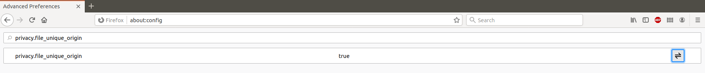
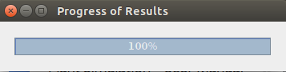

Plant Simulation - User Manual

**0.** Contents
    Contents
    Dependencies
    Building and Running the Simulation

**1.** Dependencies
The plant simulation is dependant on:
    Firefox Version 73.0.1
    DESMO-J Version 2.5.1e.
    three.js Version r114 

**2.** Installations
For the program to show the results of the simulation and the timeline of the board it needs to make use of Firefox and changing of a specific config to allow for Firefox to read files on the computer.

To change this config you need to open up a new tab in the Firefox browser and type into the search bar: **about:config** 

Pressing **Enter** will bring you to a warning page, press the Accept the Risks and Continue button.

Proceeding to the new search bar you need to type in: **privacy.file_unique_origin**
This will bring up the config which should be set to **true** as default.

To disable this config you need to click on the button to the right of the config 

This will disable the config allowing firefox to read the needed files.

3. Building and Running the Simulation

The simulation is built and ran via the terminal and running a shell script called start.sh. To run this script you need to change the directory in the terminal to where the code is stored and to run the script by typing in **./start.sh**

This will compile and run the program will then prompt you as to change and enter in data about the simulation. It fill first prompt you enter in the number of plants to start in the simulation. Enter in a whole number for example 5

After the plants you will be prompted to enter in the size of the boardstate which is entered in integers following the order of Y-axis size then X-axis size. This can be entered one after another on the same line or entered one at a time for example

After all info has been entered into the simulation the programme will run the simulation and bring up a prompt of how fair along the simulation is for example:

The programme will run and may stall at times but will finish and reach 100% as the simulation finishes and is ready to display the simulation

To access the simulation info and to go through the varying boardstates all you need to do is to close the percentage prompt  by clicking on the x button and and a new tab will be opened in Firefox with the Simulation information.

Upon closing the results progress prompt the Plant simulation tab will be opened, up the top left of the tab will contain the legend and the board progress slider. Below it is the actual board state which can be affected by the slider to show the simulation running and showing the boardstate at each tic.

Navigation through the simulations boardstates can be achieved by clicking on the green slider button, **holding** and **dragging** the slider to the selected boardstate. Navigation can also be achieved by **clicking** on the green slider and using the **Left** and **Right** keys on the keyboard to cycle through boardstates.

The simulation will continue even after the last plant has died up to boardstate **1499**, should you wish to rewatch the simulation the boardstate can be brought back to boardstate **0**.

Should a new simulation desired a new simulation can be run by entering **./start.sh** into the terminal and entering the new simulation information.

